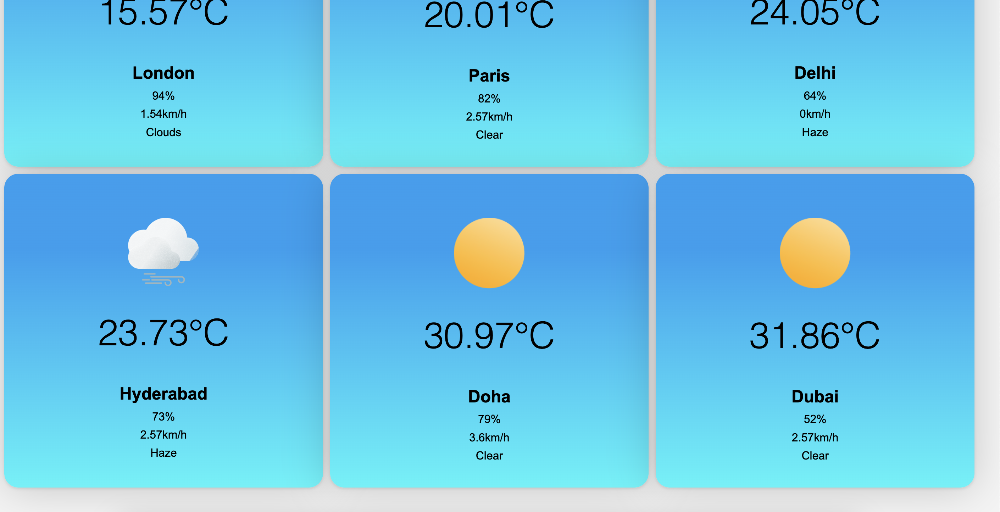

# INFO6150-Assignment5
### Simple Weather App with HTML, SCSS and Js

 
 CSS Grid layout - 1
 

  
    
   Grid 1 implemented in the index.html file and 

 
 CSS Grid layout - 2
 

  
    
   Grid 2 implemented in the index.html file 

 
 Flex Grid layout - 1
 

  
    
 Grid 1 implemented in the flex-layout.html file and 

 
 Flex Grid layout - 2
 

  
    
   Grid 2 implemented in the flex-layout.html file  

- Variables: Used variables for ccomputing colors and sizes.
- Custom Properties: 1. $margin for sizes in em.
- Nesting : Example - .showcase { ... h1{ /*code*/} }
- Interpolation: Implemented Interpolation for #{$image} & #{$margin}
- Placeholder Selectors : Implmented for buttons in - $btn
- Mixins : Implemented Mixins at _config.scss  to set background color for the page.
- Functions : Implemented the @function to set text color of the page.
- Extra features - 1. Calc : Implemented in the scss files to calcualte the margin based on the em values.
                    2. @extend : Implemented in buttons for the flex layout page to mimic the type of buttons in the pages.
                    3.Operators : Implmented the * (multiply) or / (divide) operators to calcualte the height or width of certain properties of cards and the body. 
